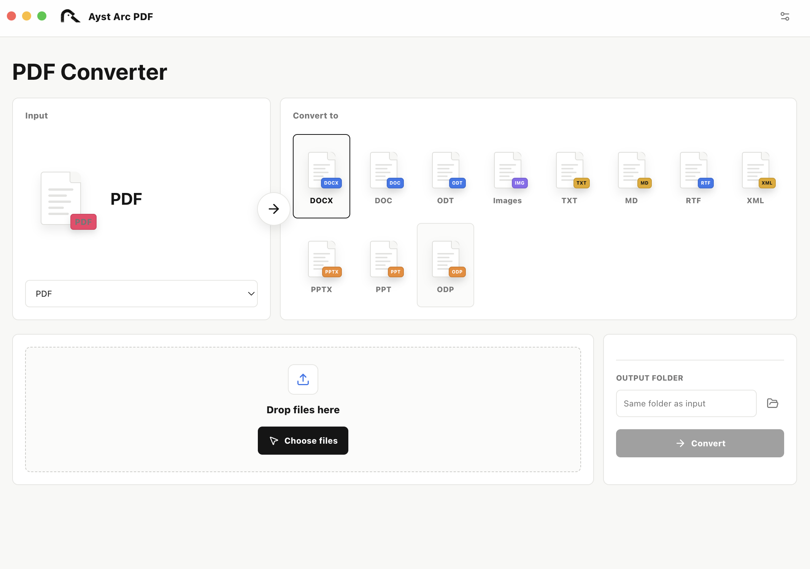

# Ayst Arc PDF



Ayst Arc PDF is a small local-first desktop converter for everyday PDF and Office workflows. Files stay on the device; there is no account, upload, activation code, or trial limit.

## Current capabilities

- PDF to and from DOC/DOCX, PPT/PPTX, and other supported office formats through an isolated background office runtime
- Per-page PDF export to PNG, JPG, BMP, GIF, WebP, or TIFF
- PDF to TXT and Markdown
- PNG/JPG/JPEG/BMP/GIF/WebP/TIFF to PDF, with optional multi-page merging
- Local HTML, Markdown, and SVG to PDF
- Batch drag-and-drop, progress, cancellation, timeouts, retry, and output folder selection

PDF to TXT/Markdown reads the existing text layer and does not perform OCR. Complex layouts, scanned files, and font substitution should be checked against the actual output. PDF to PPTX editability also depends on the source document and the selected conversion path.

## Development

Requires Node.js, pnpm, Rust 1.88, and a local LibreOffice runtime for office conversion development.

```bash
pnpm install
cargo build --locked --manifest-path rust-engine/Cargo.toml --bin minimal-pdf-converter
pnpm typecheck
pnpm build
pnpm desktop:test
pnpm desktop:dev
```

`desktop:dev` starts the Electron workspace. The bundled office runtime is launched in the background by the Rust engine and its window is hidden from the user.

## Release boundary

This repository contains source and build scripts. Release packages still require platform-specific office/PDFium runtime assembly, signing, notarization, clean-machine installation, and real-document acceptance. A local development build is not a cross-platform release.

Download the latest macOS and Windows installers from the [GitHub Releases](https://github.com/alitayin/PDFConverter/releases) page. Each tagged release is built by GitHub Actions and includes checksums and the corresponding runtime notices.

The project is MIT licensed. Third-party runtime and dependency licenses and NOTICE obligations follow the inventory shipped in each release package.
